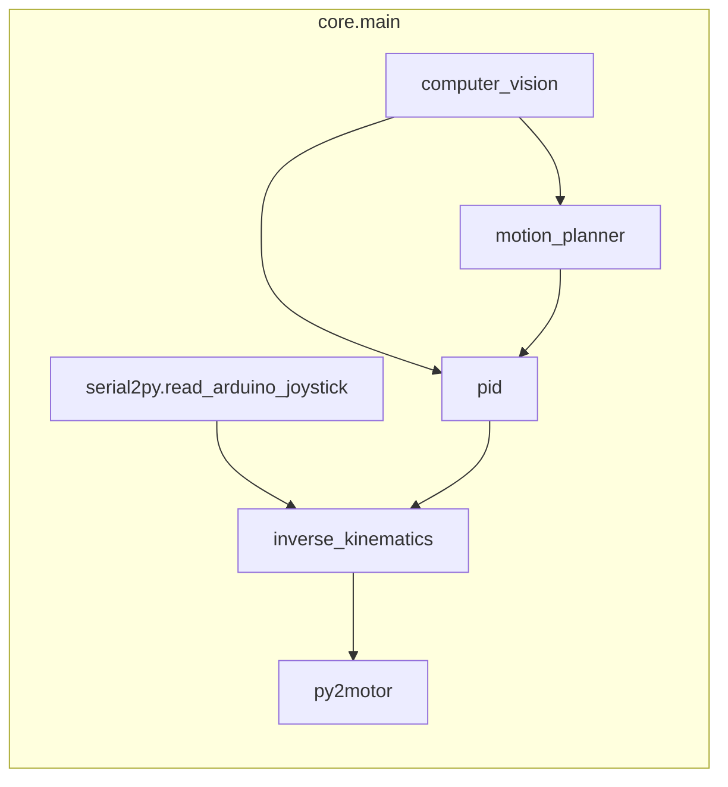

# Ball Balancing Robot

Moving a ball along trajectories using computer vision, PID control, inverse kinematics, and three stepper motors.

https://github.com/user-attachments/assets/f4a4e480-b639-42fb-8478-f429e09720b2


# Architecture

| **Package**           | **Input**                         | **Details**                                      | **Output**                                  |
|-|-|-|-|
| **computer_vision** | camera frames (USB) | compute ball position using Circle Hough Transform | ball (x, y) in global frame|
| **trajectory_planner** | ball (x, y) | stores and updates target waypoints | current target position |
| **pid** | ball (x, y) and target (x, y) | calculates tilt adjustments to minimize positional, accumulated, velocity errors  | direction and angle of platform tilt |
| **inverse_kinematics** | direction and angle of platform tilt | convert tilt target to stepper motor angles | angle for each stepper motor |
| **py2motor** | 3 stepper motor angles | communicate with stepper driver over serial | instructions encoded with custom protocol |
| **core** | static config specifying trajectory and controller params |integration of modules, sanity checks between packages | None |
| **serial2py** | joystick position over serial | convert joystick commands of target tilt positions (used to test subsystems) | direction and angle of platform tilt | 



# Installation

1. **Install Dependencies:**

    ```sh
    pip install -e src
    ```

2. **Start the Application:**

    ```sh
    start
    ```

To change the mode of operation, the static config can be changed in src/core/main.py

Since serial interfaces may vary between devices, they may need to be changed.

# Reproducing the Setup

## Required Hardware

- **Camera:** Connected to the device running `core.main` (e.g. Raspberry Pi)
- **Transparent plate:** (polycarbonate)
- **Three linkages:** Connecting the plate to the motors
- **Three motors**
- **Motor driver:** Implements the protocol specified below

## Embedded Protocol

All commands should be ASCII encoded and insensitive to blank spaces.

On startup, the motor driver should receive a `<h>` command via serial, raise the platform to an acceptable starting position, and emit a `HOME` command via serial in response.

The driver should accept commands of the format `<a,rad1,rad2,rad3>` representing an absolute movement of the motors to a given degree in radians.

## Computer Vision

The computer_vision module can be run independently with
```sh
python src/computer_vision/ball_detection.py
```

It may be necessary to adjust the parameters for the Hough Circle Transform to improve ball detection.
