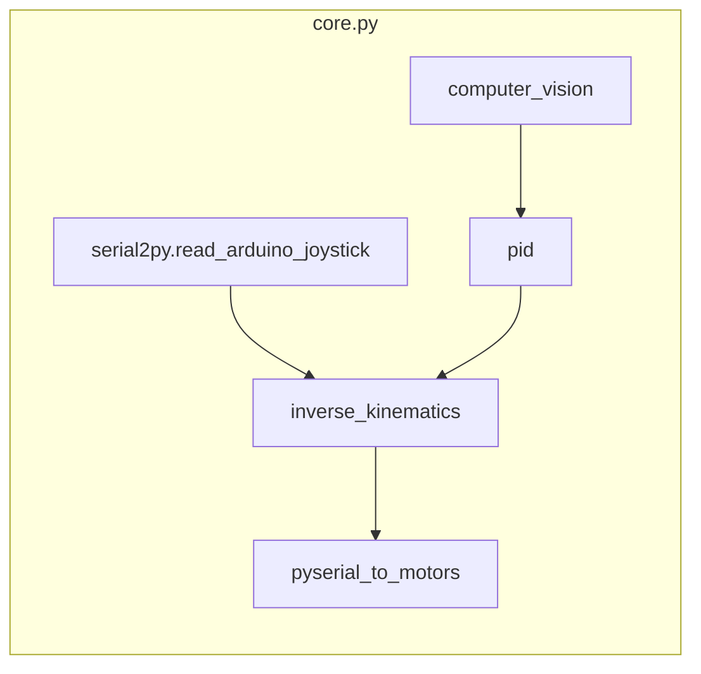

```mermaid
flowchart LR
    subgraph core.py
        serial2py.read_arduino_joystick --> inverse_kinematics
        computer_vision --> pid
        pid --> inverse_kinematics --> pyserial_to_motors
    end
```

