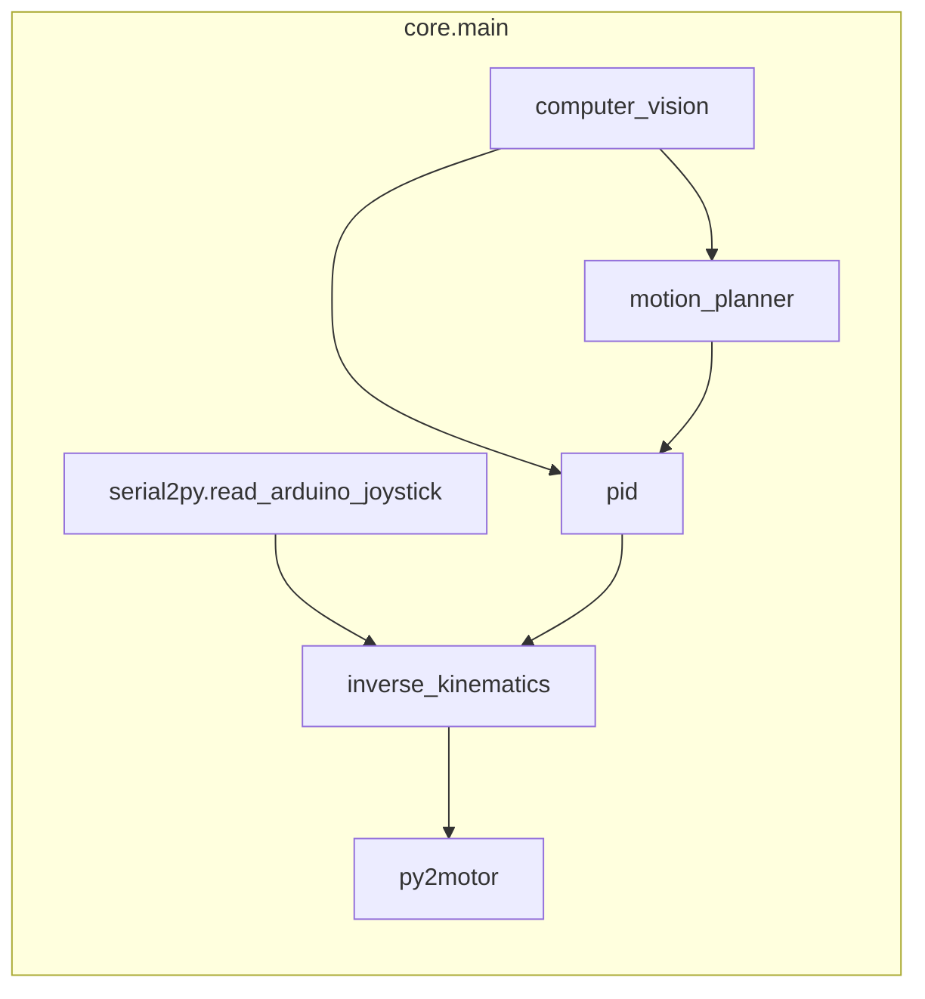
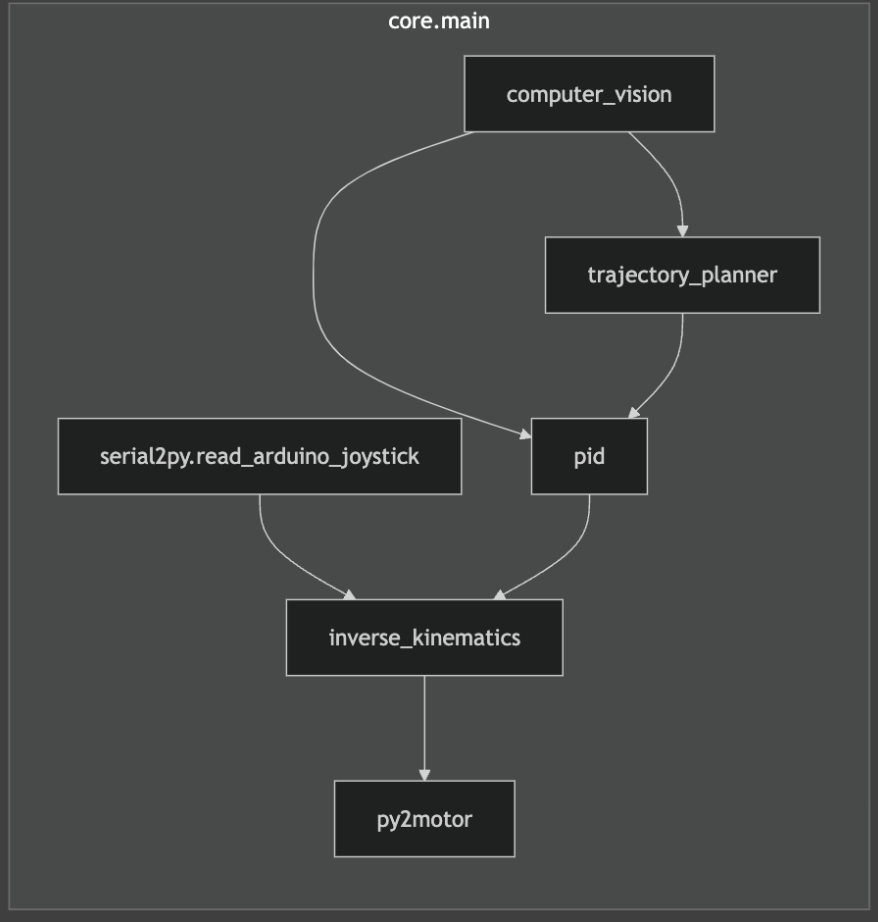

```mermaid
flowchart LR
    subgraph core.main

        serial2py.read_arduino_joystick --> inverse_kinematics
        computer_vision --> pid
        computer_vision --> motion_planner
        motion_planner --> pid
        pid --> inverse_kinematics --> py2motor
    end
```

